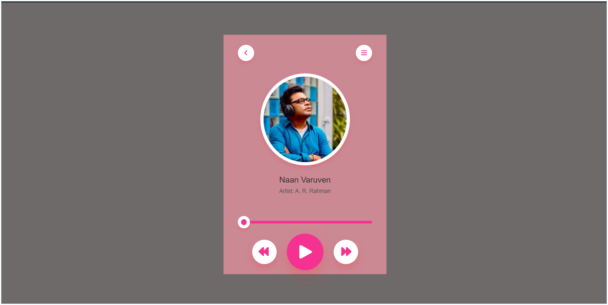

# Music Player

A simple, responsive web-based music player built with HTML, CSS, and JavaScript. This project features a clean, modern UI with a pink theme and provides basic playback controls for audio files.

This project was built following a YouTube tutorial: [Music Player Tutorial](https://youtu.be/JtrFzoL1joI?si=IAmOjn8CgGdaR-F4). Thank you to the creator!

## Features

- Play/pause functionality
- Progress bar with seek capability
- Artist image display
- Responsive design optimized for various screen sizes
- Clean, modern UI with a pink color scheme

## Technologies Used

- HTML5
- CSS3
- JavaScript (ES6+)
- Font Awesome for icons

## Prerequisites

- A modern web browser with HTML5 audio support (e.g., Chrome, Firefox, Safari, Edge)
- Audio files in MP3 format (place them in the `media/` folder)

## Installation

1. Clone the repository:
   ```
   git clone https://github.com/KabileshwaranKabil/javascript-projects.git
   cd javascript-projects/Music-Player
   ```

2. Open `index.html` in your web browser to run the application.

## Usage

- Click the play button (▶️) to start playing the music.
- Click the pause button (⏸️) to pause playback.
- Use the progress bar to seek to different parts of the track.
- The backward (⏮️) and forward (⏭️) buttons are placeholders for future implementation of track navigation.

## File Structure

```
Music-Player/
├── index.html      # Main HTML file
├── script.js       # JavaScript functionality for playback and progress
├── style.css       # CSS styling for the UI
├── README.md       # Project documentation (this file)
└── media/          # Directory for audio files and artist images
    ├── Naan-Varuven.mp3  # Sample audio file
    └── arr-dp.jpeg       # Artist image
```

## Demo

You can view a live demo by opening `index.html` in a web browser. For a hosted version, check the repository's GitHub Pages or deploy it to a web server.

## Screenshots



## Contributing

Contributions are welcome! Please feel free to submit issues, feature requests, or pull requests.

## License

This project is licensed under the MIT License - see the [LICENSE](../../LICENSE) file for details.